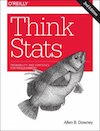
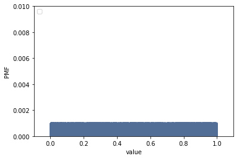
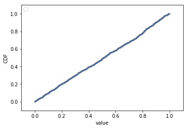
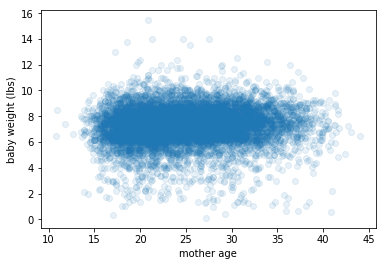
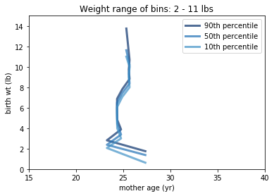
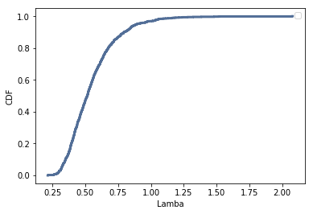
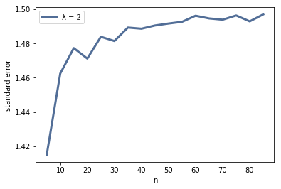
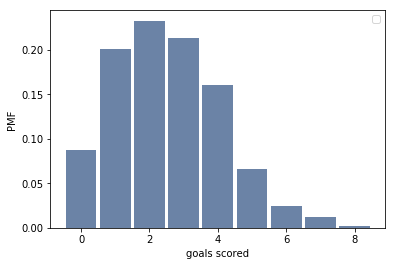
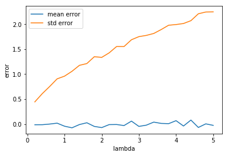
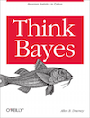

# Statistics

# Table of Contents

[1. Introduction](#section-a)  
[2. Why We Are Using Think Stats](#section-b)  
[3. Instructions for Cloning the Repo](#section-c)  
[4. Required Exercises](#section-d)  
[5. Optional Exercises](#section-e)  
[6. Recommended Reading](#section-f)  
[7. Resources](#section-g)

## <a name="section-a"></a>1.  Introduction

[](http://greenteapress.com/thinkstats2/)

Use Allen Downey's [Think Stats (second edition)](http://greenteapress.com/thinkstats2/) book for getting up to speed with core ideas in statistics and how to approach them programmatically. This book is available online, or you can buy a paper copy if you would like.

Use this book as a reference when answering the 6 required statistics questions below.  The Think Stats book is approximately 200 pages in length.  **It is recommended that you read the entire book, particularly if you are less familiar with introductory statistical concepts.**

Complete the following exercises along with the questions in this file. Some can be solved using code provided with the book. The preface of Think Stats [explains](http://greenteapress.com/thinkstats2/html/thinkstats2001.html#toc2) how to use the code.  

Communicate the problem, how you solved it, and the solution, within each of the following [markdown](https://guides.github.com/features/mastering-markdown/) files. (You can include code blocks and images within markdown.)

## <a name="section-b"></a>2.  Why We Are Using Think Stats

The stats exercises have been chosen to introduce/solidify some relevant statistical concepts related to data science.  The solutions for these exercises are available in the [ThinkStats repository on GitHub](https://github.com/AllenDowney/ThinkStats2).  You should focus on understanding the statistical concepts, python programming and interpreting the results.  If you are stuck, review the solutions and recode the python in a way that is more understandable to you.

For example, in the first exercise, the author has already written a function to compute Cohen's D.  **You could import it, or you could write your own code to practice python and develop a deeper understanding of the concept.**

Think Stats uses a higher degree of python complexity from the python tutorials and introductions to python concepts, and that is intentional to prepare you for the bootcamp.  

**One of the skills to learn here is to understand other people’s code.  And this author is quite experienced, so it’s good to learn how functions and imports work.**

---

## <a name="section-c"></a>3.  Instructions for Cloning the Repo
Using the [code referenced in the book](https://github.com/AllenDowney/ThinkStats2), follow the step-by-step instructions below.  

**Step 1. Create a directory on your computer where you will do the prework.  Below is an example:**

```
(Mac):      /Users/yourname/ds/metis/metisgh/prework  
(Windows):  C:/ds/metis/metisgh/prework
```

**Step 2. cd into the prework directory.  Use GitHub to pull this repo to your computer.**

```
$ git clone https://github.com/AllenDowney/ThinkStats2.git
```

**Step 3.  Put your ipython notebook or python code files in this directory (that way, it can pull the needed dependencies):**

```
(Mac):     /Users/yourname/ds/metis/metisgh/prework/ThinkStats2/code  
(Windows):  C:/ds/metis/metisgh/prework/ThinkStats2/code
```

---


## <a name="section-d"></a>4.  Required Exercises

*Include your Python code, results and explanation (where applicable).*

### Q1. [Think Stats Chapter 2 Exercise 4](statistics/2-4-cohens_d.md) (effect size of Cohen's d)  
*Cohen's D is an example of effect size.  Other examples of effect size are:  correlation between two variables, mean difference, regression coefficients and standardized test statistics such as: t, Z, F, etc. In this example, you will compute Cohen's D to quantify (or measure) the difference between two groups of data.*   

*You will see effect size again and again in results of algorithms that are run in data science.  For instance, in the bootcamp, when you run a regression analysis, you will recognize the t-statistic as an example of effect size.*

**My response**

Using the built-in function provided by Allen in his `thinkstat2` module, we compute:
  ```Python3
CohenEffectSize(firsts.totalwgt_lb, others.totalwgt_lb)  
-0.088672927072602006
```
Cohen's d for the difference in pregnancy lengths was:
```Python3
CohenEffectSize(firsts.prglngth, others.prglngth)
0.028879044654449883
```
The effect of birth order on baby weight is larger than for pregnancy length, but it is still a small effect. (According to Cohen and [Sawilowsky](https://digitalcommons.wayne.edu/jmasm/vol8/iss2/26/), a *d* on the order of 0.01 is 'very small' and 0.20 is 'small').


### Q2. [Think Stats Chapter 3 Exercise 1](statistics/3-1-actual_biased.md) (actual vs. biased)
*This problem presents a robust example of actual vs biased data.  As a data scientist, it will be important to examine not only the data that is available, but also the data that may be missing but highly relevant.  You will see how the absence of this relevant data will bias a dataset, its distribution, and ultimately, its statistical interpretation.*

**My response:**

Construct the PMF for the actual number of children per family:
```
actual_pmf = thinkstats2.Pmf(resp.numkdhh, label='actual')
```
Use the provided function `BiasPmf` to construct the biased PMF:
```
bias_pmf = BiasPmf(actual_pmf, label='bias')
```
Overlay histograms of the two PMFs:
```
thinkplot.PrePlot(2)
thinkplot.Pmfs([actual_pmf, bias_pmf])
thinkplot.Config(xlabel='# children in family', ylabel='probability')
```


We expect the PMFs to align for n=1 children.


The actual vs biased means:
```
print('Actual mean: %.2f' % (actual_pmf.Mean()))
print('Biased mean: %.2f' % (bias_pmf.Mean()))

Actual mean: 1.02
Biased mean: 2.40
```


### Q3. [Think Stats Chapter 4 Exercise 2](statistics/4-2-random_dist.md) (random distribution)  
*This questions asks you to examine the function that produces random numbers.  Is it really random?  A good way to test that is to examine the pmf and cdf of the list of random numbers and visualize the distribution.  If you're not sure what pmf is, read more about it in Chapter 3.*

**My response:**

```
import numpy as np

sample2 = np.random.random(1000)
samp2_pmf = thinkstats2.Pmf(sample2)

thinkplot.Pmf(samp2_pmf)
thinkplot.Config(xlabel='value', ylabel='PMF',
                 axis = [-0.1, 1.1, 0, 0.01])
```



The PMF looks like a block. We would expect a uniform distribution to yield a step function for its PMF. However, note that the probabilities are extremely low because of the large number of values (1000) in our dataset; the maximum probability is only 0.001.

The CDF yields a better way to examine a uniform distribution for large number of values:

```
samp2_cdf = thinkstats2.Cdf(sample2)

thinkplot.Cdf(samp2_cdf)
thinkplot.Config(xlabel='value', ylabel='CDF',
                 axis = [-0.1, 1.1, -0.1, 1.1])
```


The CDF is a straight line for uniform distributions. Our random sampling yields a more or less straight line, confirming the proper functioning of `random.random`.


### Q4. [Think Stats Chapter 5 Exercise 1](statistics/5-1-blue_men.md) (normal distribution of blue men)
*This is a classic example of hypothesis testing using the normal distribution.  The effect size used here is the Z-statistic*

**My response**:

Generate an analytic normal distribution using the mean (178 cm) and standard deviation (7.7) of male heights:
```Python
import scipy.stats as stats

dist = stats.norm(loc=178, scale=7.7)
```
The percent of men between 5'10" and 6'1" is equal to the difference in the evaluation of the CDF at these values:
```Python
# convert heights to centimeters:
blue_min_ht = (5*12 + 10) * 2.54   
blue_max_ht = (6*12 + 1) * 2.54

dist.cdf(blue_max_ht) - dist.cdf(blue_min_ht)
0.34274683763147457
```
34% of men fall in this height range.


### Q5. Bayesian (Elvis Presley twin)

*Bayes' Theorem is an important tool in understanding what we really know, given evidence of other information we have, in a quantitative way.  It helps incorporate conditional probabilities into our conclusions.*

*Elvis Presley had a twin brother who died at birth.  What is the probability that Elvis was an identical twin? Assume we observe the following probabilities in the population: fraternal twin is 1/125 and identical twin is 1/300.*  

**My response:**

Bayes' Theorem states:

P(A|B) = (P(B|A)/P(B)) x P(A)

Or, in words: the posterior probability P(A|B) is equal to the prior probability P(A) times the likelihood ratio P(B|A)/P(B).


We want to find P(A|B) = Elvis had an identical twin, given that he had a male twin.
- P(A) = Elvis had an identical twin = 1/300
- P(B) = Elvis had a male twin = sum of:
  - Probability of fraternal male twin =  1/125 x 0.5 = 1/250
  - Probability of identical male twin =  1/300
  - sum = 11/1500
- P(B|A) = the probability that Elvis had a male twin, given that he had an identical twin = 1

Thus:

P(A|B) = 1/(11/1500) x 1/300 = 1500/11 x 1/300 = 5/11 = 45.4%

---

### Q6. Bayesian &amp; Frequentist Comparison  
*How do frequentist and Bayesian statistics compare?*

Frequentist:
- The data are random.
- Parameters are fixed; they are presented with confidence intervals.
  - probability of the data, given the null hypothesis (H0)

Bayesian stats:
- The data are fixed.
- Parameters are random; they are presented with probability intervals.
  - probability of H0 given the data.
- require prior knowledge of the distribution. If not explicitly provided, it must be assumed or estimated. This can be subjective and can impact results

## <a name="section-e"></a>5.  Optional Exercises

The following exercises are optional, but we highly encourage you to complete them if you have the time.

### Q7. [Think Stats Chapter 7 Exercise 1](statistics/7-1-weight_vs_age.md) (correlation of weight vs. age)
*In this exercise, you will compute the effect size of correlation.  Correlation measures the relationship of two variables, and data science is about exploring relationships in data.*   

**The Problem:**
Using data from the NSFG, make a scatter plot of birth weight versus mother’s age. Plot percentiles of birth weight versus mother’s age. Compute Pearson’s and Spearman’s correlations. How would you characterize the relationship between these variables?

**My Answer:**
```Python
import first
​
live, firsts, others = first.MakeFrames()
live = live.dropna(subset=['agepreg', 'totalwgt_lb'])

agepreg
# pull out birth weight & mother's age
birthwt = live.totalwgt_lb
mom_age = live.agepreg

# Scatter Plot:
plt.scatter(mom_age, birthwt, alpha=0.1)
plt.xlabel('mother age')
plt.ylabel('baby weight (lbs)')
Text(0,0.5,'baby weight (lbs)')
```


A hexbin plot doesn't reveal any patterns.

Now, plot percentile of birth weight vs. mother's age.
```Python
# generate groupings by mother's age
bins = np.arange(15, 40, 3)
indices = np.digitize(live.agepreg, bins)
age_groups = live.groupby(indices)

# for each group, compute average mother's age and cdf of weights:
mean_ages = [group.agepreg.mean() for i, group in age_groups]
wt_cdfs = [thinkstats2.Cdf(group.totalwgt_lb) for i, group in age_groups]

# create percentiles & plot them
p_tiles = [75, 50, 25]
for p in p_tiles:
    wt_ptiles = [cdf.Percentile(p) for cdf in wt_cdfs]
    thinkplot.Plot(mean_ages, wt_ptiles, label='%dth percentile' % p)

thinkplot.Config(xlabel='mother age (yr)', ylabel='birth wt (lb)',
                axis=[14,41,5,10])
```


```Python
# Compute correlations
SpearmanCorr(birthwt, mom_age), Corr(birthwt, mom_age)
```

These variables are not very correlated:

1. The scatter plot shows a roughly horizontal line / relationship.
2. The correlation coefficients are low.
3. The percentile plots do show a slight upward trend until age 39, and then the birth weight drops off sharply for mothers over the age of 40. There are fewer data in the tails, though.

---

### Q8. [Think Stats Chapter 8 Exercise 2](statistics/8-2-sampling_dist.md) (sampling distribution)
*In the theoretical world, all data related to an experiment or a scientific problem would be available.  In the real world, some subset of that data is available.  This exercise asks you to take samples from an exponential distribution and examine how the standard error and confidence intervals vary with the sample size.*

**The Problem**
Suppose you draw a sample with size n=10 from an exponential distribution with λ=2. Simulate this experiment 1000 times and plot the sampling distribution of the estimate L. Compute the standard error of the estimate and the 90% confidence interval.

Repeat the experiment with a few different values of n and make a plot of standard error versus n.

**My Solution**
```Python
# Write a function to simulate the sampling process and return a list
# of the L's (estimate of lambda) and the standard error.

def SimulateSampleExpo(lam=2, n=10, iters=1000):
    els = []
    for j in range(iters):
        xs = np.random.exponential(lam, n)
        L = 1/np.mean(xs)
        els.append(L)
    stderr = RMSE(els, lam)
    return els, stderr

# Run simulations & plot the CDF of the L's:
lam = 2
els, stderr = SimulateSampleExpo(lam=lam)
el_cdf = thinkstats2.Cdf(els)

thinkplot.Cdf(el_cdf)
thinkplot.Config(xlabel='Lamba', ylabel='CDF')
```

```Python
# The 90% CI and the standard error:
el_cdf.Percentile(5), el_cdf.Percentile(95)
(0.32124284348591603, 0.88840034716615901)

stderr
1.4597650639661728

# Standard Error vs. n:
ns = range(5,90,5)
stderrs = []
for n in ns:
    stderrs.append(SimulateSampleExpo(lam=lam, n=n)[1])

thinkplot.Plot(ns, stderrs, label='λ = 2')
thinkplot.Config(xlabel='n', ylabel='standard error')
```


As n increases, the standard error rises until it plateaus at near 1.50.

---

### Q9. [Think Stats Chapter 6 Exercise 1](statistics/6-1-household_income.md) (skewness of household income)

**The Problem**

Compute the median, mean, skewness and Pearson’s skewness of the [Interpolated] sample. What fraction of households reports a taxable income below the mean? How do the results depend on the assumed upper bound?

**My Answer**
```Python
# load modules and data
import thinkstats2
import numpy as np
import hinc

income_df = hinc.ReadData()
log_sample = InterpolateSample(income_df, log_upper=6.0)
sample = np.power(10, log_sample)
cdf = thinkstats2.Cdf(sample)

# Compute statistics
sample.mean(), np.median(sample)
(74278.707531187203, 51226.933065623722)

thinkstats2.Skewness(sample), thinkstats2.PearsonMedianSkewness(sample)
(4.9499202444295829, 0.7361258019141782)

# Fraction of household with income below mean:
cdf[sample.mean()]
0.66000587956687196
```
The assumed upper-bound will impact the mean, standard deviation, and skew. For example, let's re-compute the sample with a higher upper-bound, e.g. 10 million:
```Python
new_log_sample = InterpolateSample(income_df, log_upper = 7.0)
new_sample = np.power(10, new_log_sample)
new_cdf = thinkstats2.Cdf(new_sample)

thinkstats2.PearsonMedianSkewness(new_sample), thinkstats2.PearsonMedianSkewness(sample)
(0.39156450927742087, 0.7361258019141782)

new_sample.mean(), sample.mean()
(124267.39722164697, 74278.707531187203)

np.std(new_sample), np.std(sample)
(559608.50137434725, 93946.929963478353)

np.median(new_sample), np.median(sample)
(51226.933065623722, 51226.933065623722)

```

The skew is actually reduced in our higher-upper-bound sample. While the mean is higher (by 3-fold), the standard deviation is also higher (by 5-fold). (The medians are the same.)

---
### Q10. [Think Stats Chapter 8 Exercise 3](statistics/8-3-scoring.md) (scoring)

**The Problem**

In games like hockey and soccer, the time between goals is roughly exponential. So you could estimate a team’s goal-scoring rate by observing the number of goals they score in a game. This estimation process is a little different from sampling the time between goals, so let’s see how it works.

Write a function that takes a goal-scoring rate, lam, in goals per game, and simulates a game by generating the time between goals until the total time exceeds 1 game, then returns the number of goals scored.

Write another function that simulates many games, stores the estimates of lam, then computes their mean error and RMSE.

Is this way of making an estimate biased? Plot the sampling distribution of the estimates and the 90% confidence interval. What is the standard error? What happens to sampling error for increasing values of lam?

**My Solution**

Write functions to simulate games

```Python

def GameSim(lam):
    '''lam is goals per game
    Returns # of goals scored in a game (60 min)'''
    t = 0
    goals = 0
    while t <= 60:
        time_between_goals = random.expovariate(lam/60)
        t += time_between_goals
        if t <= 60:
            goals +=1
        else:
            break
    return goals

def MultiGameSimEval(lam, m):
    '''Simulates a game m (integer) times, with an average of lam (float) goals per game
    Returns estimates of lam (list), mean error (float), and RMSE (float)'''
    lams = []
    for _ in range(m):
        goals = GameSim(lam)
        lams.append(goals)
    return lams, MeanError(lams, lam), RMSE(lams, lam)
```
Simulate 10 games, 100 times, at a goal-scoring rate of 2.5 goals per game:

```Python
l, m, s = MultiGameSimEval2(2.5, 1000)

m, s
(0.029999999999999999, 1.5786069808536893)

np.mean(l)
2.5299999999999998

# Plot sampling distribution:
lam_pmf = thinkstats2.Pmf(l)
thinkplot.Hist(lam_pmf)
thinkplot.Config(xlabel='goals scored', ylabel='PMF')
```


```Python
lam_cdf = thinkstats2.Cdf(l)
lam_cdf.Percentile(5), lam_cdf.Percentile(90)```

Impact on sampling error as lambda increases in magnitude:
```Python
lam_vals = np.linspace(0.2, 5.0, 25)
mean_errs = []
std_errs = []

for lam in lam_vals:
    l, m, s = MultiGameSimEval(lam, 1000)
    mean_errs.append(m)
    std_errs.append(s)

plt.plot(lam_vals, mean_errs, label='mean error')
plt.plot(lam_vals, std_errs, label='std error')
plt.legend()
plt.ylabel('error')
plt.xlabel('lambda')
```


As lambda get bigger, standard error (RMSE) also increases. Mean error stays constant.

---
### Q11. [Think Stats Chapter 9 Exercise 2](statistics/9-2-resampling.md) (resampling)

**The Problem**
In Section 9.3, we simulated the null hypothesis by permutation; that is, we treated the observed values as if they represented the entire population, and randomly assigned the members of the population to the two groups.

An alternative is to use the sample to estimate the distribution for the population, then draw a random sample from that distribution. This process is called resampling. There are several ways to implement resampling, but one of the simplest is to draw a sample with replacement from the observed values, as in Section 9.10.

Write a class named DiffMeansResample that inherits from DiffMeansPermute and overrides RunModel to implement resampling, rather than permutation.

Use this model to test the differences in pregnancy length and birth weight. How much does the model affect the results?

**My Solution**

```Python
class DiffMeansResample(DiffMeansPermute):

    def RunModel(self):
        """Run the model of the null hypothesis.

        returns: simulated data
        """
        #np.random.shuffle(self.pool)
        data = np.random.choice(self.pool, self.n, replace=True), np.random.choice(self.pool, self.m, replace=True)
        return data

# Pregnancy Length
preglen_data = firsts.prglngth.values, others.prglngth.values
ht_resamp = DiffMeansResample(preglen_data)
ht_perm = DiffMeansPermute(preglen_data)

print(ht_resamp.PValue(), ht_perm.PValue())
print(ht_resamp.MaxTestStat(), ht_perm.MaxTestStat())
print(ht_resamp.actual)

0.168 0.184
0.194908247232 0.22251009844
0.0780372667775

# Birth weight
data = firsts.totalwgt_lb.dropna().values, others.totalwgt_lb.dropna().values
ht_resamp = DiffMeansResample(data)
ht_perm = DiffMeansPermute(data)

print(ht_resamp.PValue(), ht_perm.PValue())
print(ht_resamp.MaxTestStat(), ht_perm.MaxTestStat())
print(ht_resamp.actual)

0.0 0.0
0.0937366968957 0.100723279498
0.124761184535
```
Resampling doesn't make much difference

---

## <a name="section-f"></a>6.  Recommended Reading

Read Allen Downey's [Think Bayes](http://greenteapress.com/thinkbayes/) book.  It is available online for free, or you can buy a paper copy if you would like.

[](http://greenteapress.com/thinkbayes/)

---

## <a name="section-g"></a>7.  More Resources

Some people enjoy video content such as Khan Academy's [Probability and Statistics](https://www.khanacademy.org/math/probability) or the much longer and more in-depth Harvard [Statistics 110](https://www.youtube.com/playlist?list=PL2SOU6wwxB0uwwH80KTQ6ht66KWxbzTIo). You might also be interested in the book [Statistics Done Wrong](http://www.statisticsdonewrong.com/) or a very short [overview](http://schoolofdata.org/handbook/courses/the-math-you-need-to-start/) from School of Data.
