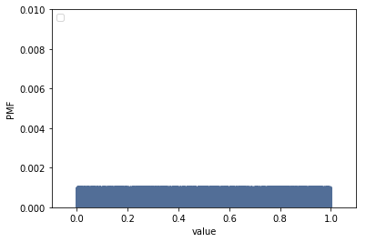
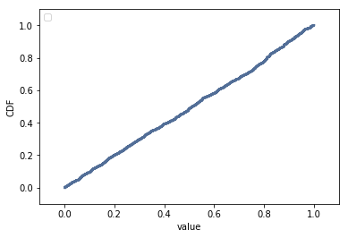

[Think Stats Chapter 4 Exercise 2](http://greenteapress.com/thinkstats2/html/thinkstats2005.html#toc41) (a random distribution)

This questions asks you to examine the function that produces random numbers. Is it really random? A good way to test that is to examine the pmf and cdf of the list of random numbers and visualize the distribution. If you're not sure what pmf is, read more about it in Chapter 3.

### The Problem
*The numbers generated by `random.random` are supposed to be uniform between 0 and 1; that is, every value in the range should have the same probability.
Generate 1000 numbers from `random.random` and plot their PMF and CDF. Is the distribution uniform?*

### The Solution
```
import numpy as np

sample2 = np.random.random(1000)
samp2_pmf = thinkstats2.Pmf(sample2)

thinkplot.Pmf(samp2_pmf)
thinkplot.Config(xlabel='value', ylabel='PMF',
                 axis = [-0.1, 1.1, 0, 0.01])
```



The PMF looks like a block. We would expect a uniform distribution to yield a step function for its PMF (or square/rectangle when plotted as a bar chart). However, note that the probabilities are extremely low because of the large number of values (1000) in our dataset; the maximum probability is only 0.001.

The CDF yields a better way to examine a uniform distribution for large number of values:

```
samp2_cdf = thinkstats2.Cdf(sample2)

thinkplot.Cdf(samp2_cdf)
thinkplot.Config(xlabel='value', ylabel='CDF',
                 axis = [-0.1, 1.1, -0.1, 1.1])
```


The CDF is a straight line for uniform distributions. Our random sampling yields a more or less straight line, confirming the proper functioning of `random.random`.
